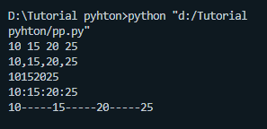

# Tugas ini untuk melengkapi pertemuan 6

# Menjelaskan Projek 

NAMA : Nova Tegar Adiyansyah

NIM  : 312010145

KELAS: TI.20.A.1

TUGAS:BAHASA PEMOGRAMAN

# Pengertian Print

* Fungsi print("") berfungsi untuk mencetak atau menampilkana obyek ke layar atau kefile text

> print

*  Hasil Print

# Bitwise (,)

* Bitwise adalah operator khusus untuk menangani operasi logika bilangan biner dalam bentuk bit.

* hasil output

# Aritmatika dalam bahasa pemograman

* Aritmatika terdiri dari 6 operator dan symbol.Berikut Contohnya

* contoh oprator symbol

* setelah di run

# Pengunaan (END)

* Jadi pengunaan *end* adalah, untuk menyatukan semua variabel,Berikut contohnya

> pengunaan end

* setelah menjalankan

# Pengunaan Separtor

* sep adalah pemisah yang berfungsi sebagai tanda pemisah antar obyek yang di cetak.contohnya seperti di bawah

* setelah menjalankan

