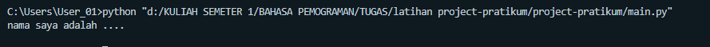
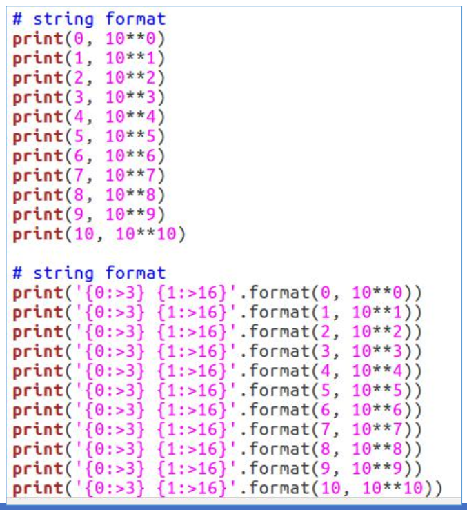
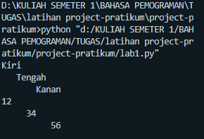

# Tugas ini untuk melengkapi pertemuan 6


NAMA : Nova Tegar Adiyansyah <br>

NIM  : 312010145<br>

KELAS: TI.20.A.1<br>

TUGAS:BAHASA PEMOGRAMAN

###  DAFTAR ISI <br>

| NO | Description | Link |
| ----- | ----- | ---- |
| 1 | Pertemuan 5 - Tugas | [click here](#pertemuan-5---tugas) |


## Pertemuan 5 - Tugas

Pada pertemuan 5 Bahasa Pemrograman, saya diberi tugas oleh Dosen untuk membuat Aplikasi Biodata dengan Python (Seperti Gambar dibawah ini):


saat ini saya akan menjelaskan hasil dari tugas tersebut.<br>
Berikut *source code* nya atau klik link berikut(Tugas 5 python):

``` python
print("Please enter your full name : ")
fullname=input()
print("Please enter nickname : ")
nickname=input()
print("Please enter your NPM : ")
npm=int(input())
print("Please enter your place of birth : ")
pob=input()
print("Please enter your date of birth : ")
date=int(input())
print("Pleae enter your month of birth : ")
month=input()
print("Please enter year of birth : ")
year=int(input())
print("Please enter your phone number : ")
phone=int(input())
print("Please enter your address : ")
address=input()

dob=2020-year

print("\n\n Assalamu'alaikum. ")
print(f"Let me introduce my self. My name is {fullname}, but you can call me {nickname}. My NPM {npm}. I was born in {pob} and Iam {dob} years old. I am very glad if you want to invite my house in {address}. So don't forget to call me before with the number {phone}. \n\n Thank You ")
```

* Berikut penjelasannya :<br>

``` python
print("please enter your full name.....")
print(123456)
```

source code diatas berfungsi untuk mencetak hasil/output<br>
Untuk menampilkan output string,saya menggunakan *tanda petik dua* didalam fungsi print(),sedangkan jika saya ingin menampilkan output saya tidak perlu menggunakan tanda petik dua.
Contohnya :

``` python
print("nama saya adalah....")
print(1234567)
```
(seperti gambar dibawah ini)


Keterangan : <br>
1. Variabel adalah sebuah wadah penyimpanan data pada program yang akan digunakan selama program itu berjalan. Yang berfungsi sebagai variable dalam source code diatas adalah **fullname** . <br>
2. Fungsi **input()** adalah untuk memasukkan nilai dari layar console di command prompt, lalu kemudian mengembalikan nilai saat kita menekan tombol enter *(newline)*<br>
<br>
Pada gambar diatas, hasil dari inputan tersebut berwarna *hijau*<br><br>
* Untuk memasukkan perintah lain seperti *Nickname, NPM, Place Of Birth, Date of Birth, Year of Birth, Phone Number, and Address* mengikuti perintah yang sama seperti memasukkan *fullname*<br>

* Untuk menghitung rumus umur saya menggunakan variable *DOB* yaitu 2020 (Tahun Sekarang) dikurangi dengan Year of Birth, pada source code berikut :<br>
``` python
dob=2020-year
```
<br> Pada syntax/source code diatas, saya menggunakan variable *dob* dimana untuk menghitung umur (variable **age** pada output), yaitu degan rumus pada variable *dob=2020-year*
<br>

* Langkah kali ini saya akan menampilkan output yang diminta oleh Dosen.<br>
Output pertama yang diminta Dosen adalah menampilkan salam, yaitu dengan mengetikkan syntax/source code berikut :
``` python
print("\n\n Assalamu'alaikum. ")
```

Keterangan :
1. Fungsi **\n** pada source code diatas adalah untuk memberi baris baru / enter / *(newline)*
2. Fungsi print() seperti dijelaskan pada poin **Outout** diatas
Hasil dari source code diatas adalah seperti gambar dibawah ini :<br>
<br><br>
* Langkah terakhir adalah menampilkan semua hasil dari inputan diatas. Dengan mengetikkan source code berikut :<br>
``` python
print(f"Let me introduce my self. My name is {fullname}, but you can call me {nickname}. My NPM {npm}. I was born in {pob} and Iam {dob} years old. I am very glad if you want to invite my house in {address}. So don't forget to call me before with the number {phone}. \n\n Thank You ")
```
Keterangan :
1. Fungsi huruf **f** pada perintah *print(f"...")* adalah fungsi print atau bisa memudahkan programmer dalam mencetak statement dalam satu baris dibandingkan dengan metode yang lama yaitu memisahkan string dan variable dengan simbol koma ( , ) atau plus ( + )<br>
2. Sedangkan fungsi {} pada output tersebut adalah untuk menampilkan hasil dari variable<br>
Hasil dari output tersebut seperti berikut :<br>


## Pertemuan 6 - Lab 1


Pada halaman ini (Tugas Pertemuan 6 - Lab 1) saya diberikan tugas oleh Dosen yaitu mempelajari Operator Aritmatika menggunakan Bahasa Pemrograman Python. Berikut source code yang diberikan oleh Dosen. <br>


``` python
# penggunaan end 
print('A', end='')
print('B', end='')
print('C', end='')
print()
print('X')
print('Y')
print('Z')

# pengggunaan separtor

w, d, y, z = 10, 15, 20, 25
print(w, d, y, z)
print(w, d, y, z, sep='+')
print(w, d, y, z, sep='x')
print(w, d, y, z, sep=':')
print(w, d, y, z, sep='-----')
print(d, z, sep='=')
```


*  Penggunaan END
 Penggunaan end digunakan untuk menambahkan karakter yang dicetak di akhir baris. Secara default penggunaan end adalah untuk ganti baris.
``` python
print("A", end="")
print("B", end="")
print("C", end="")
```

> Penggunaan print() digunakan untuk mencetak output, seperti syntax dibawah ini :
``` python 
print()
```

> Syntax dibawah ini digunakan untuk menampilkan output berupa string
``` python
print("X")
print("Y")
print("Z")
```

Hasil dari source code tersebut seperti gambar dibawah ini :<br>

<br>


* Penggunaan Separator
Separator adalah pemisah yang berfungsi sebagai tanda pemisah antar objek yang dicetak. Defaultnya adalah tanda spasi.<br><br>
 
> Pendeklarasian beberapa variable beserta nilainya
``` python
w,x,y,z=10,15,20,25
```
> Menampilkan hasil dari variable tiap-tiap variable
``` python
print(w,x,y,z)
```
> Menampilkan hasil dari tiap-tiap variable dengan menggunakan pemisah , (koma)
``` python
print(w,x,y,z,sep=",")
```
> Menampilkan hasil dari tiap-tiap variable tanpa menggunakan pemisah
``` python
print(w,x,y,z,sep="")
```
> Menampilkan hasil dari tiap-tiap variable dengan menggunakan pemisah : (titik dua)
``` python
print(w,x,y,z,sep=":")
```
> Menampilkan hasil dari tiap-tiap variable dengan menggunakan pemisah -----
``` python
print(w,x,y,z,sep="-----")
```


<br>
<hr>
<br>

## Pertemuan 6 - Lab 1-2

* String Format<br>
String formatting atau pemformatan string memungkinkan kita menyuntikkan item kedalam string daripada kita mencoba menggabungkan string menggunakan koma atau string concatenation.<br>

Penggunaan source code yang diberikan oleh dosen seperti berikut :<br>
<br><br>
``` python
#String Format 1
print(0, 10**0)
print(1, 10**1)
print(2, 10**2)
print(3, 10**3)
print(4, 10**4)
print(5, 10**5)
print(6, 10**6)
print(7, 10**7)
print(8, 10**8)
print(9, 10**9)
print(10, 10**10)

print()
print()

#String Format 2
print('{0:>3} {1:>16}'.format(0, 10**0))
print('{0:>3} {1:>16}'.format(0, 10**1))
print('{0:>3} {1:>16}'.format(0, 10**2))
print('{0:>3} {1:>16}'.format(0, 10**3))
print('{0:>3} {1:>16}'.format(0, 10**4))
print('{0:>3} {1:>16}'.format(0, 10**5))
print('{0:>3} {1:>16}'.format(0, 10**6))
print('{0:>3} {1:>16}'.format(0, 10**7))
print('{0:>3} {1:>16}'.format(0, 10**8))
print('{0:>3} {1:>16}'.format(0, 10**9))
print('{0:>3} {1:>16}'.format(0, 10**10))
```
<br>


Saat ini saya akan membahas satu persatu dari syntax yang telah di berikan oleh Dosen.<br>

1. **String Format 1** <br>
Pada syntax / source code string format 1 akan menampilkan output berupa 2 outputan.<br>
Yang pertama (sebelah kiri) akan menampilkan angka Urut dari angka 0 hingga angka 10, sedangkan untuk sebelah kanan akan menampilkan Operasi Aritmatika Pangkat.<br>
Dengan ketentuan sebagai berikut, operasi pangkat dengan angka kiri sebagai pokok (Rumus : ** [bintang dua] )<br>
Hasil dari syntax tersebut adalah 10 pangkat 0, hingga 10 pangkat 10. dengan output sebagai berikut : <br>
<br><br>

2, **String Format 2** <br>
Pada syntax atau source code string format 2 akan menampilkan output berupa 2 output'an juga (seperti String Format 1, yaitu kanan dan kiri)<br>
Dengan ketentuan sebagai berikut : <br> 
> Alignment, padding, dan precesion dengan **.format()** dalam kurung kurawal kita dapat menetapkan panjang bidang, rata kanan/kiri, parameter pembulatan dan banyak lagi. Contoh lain seperti berikut :
``` python
print('{0:8} | {1:9}'.format('Buah','Jumlah'))
print('{0:8} | {1:9}'.format('Apel', 3.))
print('{0:8} | {1:9}'.format('Jeruk',10))
```
Hasil dari source code contoh diatas akan seperti berikut :<br>
<br><br>
>Secara Default, **.format()** menggunakan rata teks ke kiri, angka ke kanan. Kita dapat menggunakan opsi opsional <, ^, atau > untuk mengatur perataan kiri, tengah, atau kanan. Contoh lain dalam penggunaan **.format()** sebagai berikut : <br>
``` python
print('{:<30}{:^30}{:>30}'.format('Kiri','Tengah','Kanan'))
print('{:<30}{:^30}{:>30}'.format(12,34,56))
```
Hasil dari source code contoh diatas akan muncul seperti ini :<br>

<br><br>
Untuk hasil dari String Format 2 adalah :<br>


<br><hr><br>


